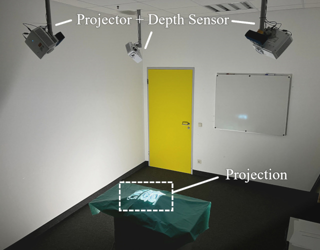

# Shadow-Free Projection with Blur Mitigation on Dynamic, Deformable Surfaces
#### Paper | Video | Slides | Supplementary (Links will follow)

C++/OpenGL implementation of our real-time projection mapping system for dynamic, uneven, and partially occluded surfaces.
It uses Orbbec Femto Bolt sensors and integrates [BlendPCR](https://github.com/muehlenb/blendpcr) for precise geometric correction. The system also includes our novel GPU-based blur mitigation strategies that improve readability and reduce visual artifacts.

Project Context: [SisOps CGVR Website](https://cgvr.cs.uni-bremen.de/research/sisops/)

[Andre Mühlenbrock¹](https://orcid.org/0000-0002-7836-3341), [Yaroslav Purgin¹](https://orcid.org/0009-0004-0924-8528),  [Nicole Steinke¹](https://orcid.org/0009-0002-8756-1793), [Verena Uslar²](https://orcid.org/0000-0003-3252-2076), [Dirk Weyhe²](https://orcid.org/0000-0002-2660-625X), [Rene Weller¹](https://orcid.org/0009-0002-2544-4153), [Gabriel Zachmann¹](https://orcid.org/0000-0001-8155-1127)\
¹Computer Graphics and Virtual Reality Research Lab ([CGVR](https://cgvr.cs.uni-bremen.de/)), University of Bremen | 
²University of Oldenburg

Accepted at ACM VRST 2025

## Setup Image



## Source Code

[>> Please find the source code on the official University of Bremen's GitLab <<](https://gitlab.informatik.uni-bremen.de/cgvr_public/DeformableProjection)

## Cite
```
Will follow.
```
