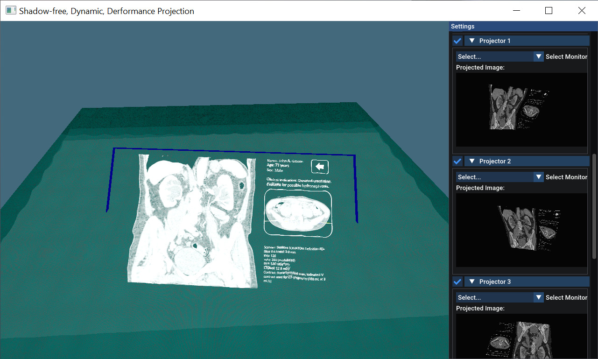

# Shadow-Free Projection with Blur Mitigation on Dynamic, Deformable Surfaces
#### Paper | Video | Slides | Supplementary (links will follow on 14.11.2025)

C++/OpenGL implementation of our real-time projection mapping system for dynamic, uneven, and partially occluded surfaces. It works with simulated sensors or Orbbec Femto Bolt sensors and integrates [BlendPCR](https://github.com/muehlenb/BlendPCR) for geometric correction. The system also includes our novel GPU-based blur mitigation strategies that improve readability and reduce visual artifacts.

Project Context: [SisOps CGVR Website](https://cgvr.cs.uni-bremen.de/research/sisops/)

[Andre Mühlenbrock¹](https://orcid.org/0000-0002-7836-3341), [Yaroslav Purgin¹](https://orcid.org/0009-0004-0924-8528),  [Nicole Steinke¹](https://orcid.org/0009-0002-8756-1793), [Verena Uslar²](https://orcid.org/0000-0003-3252-2076), [Dirk Weyhe²](https://orcid.org/0000-0002-2660-625X), [Rene Weller¹](https://orcid.org/0009-0002-2544-4153), [Gabriel Zachmann¹](https://orcid.org/0000-0001-8155-1127)\
¹Computer Graphics and Virtual Reality Research Lab ([CGVR](https://cgvr.cs.uni-bremen.de/)), University of Bremen   
²University Clinic for Visceral Surgery at the Pius-Hospital Oldenburg, University of Oldenburg

Accepted at ACM VRST 2025


**Note:** (1) This source code contains only the relevant parts of the published paper and was extracted out of a larger project. (2) To fully test the blur mitigation pipeline, you currently need Orbbec Femto Bolt sensors. (3) The NxLib part (Ensenso camera integration is not part of the public version).


## Build Requirements

### Required:
 - **CMake** ≥ 3.11
 - **OpenGL** ≥ 3.3
 - **C++ Compiler**, e.g. MSVC v143
 - **OpenCV** and **Point Cloud Library (PCL)** (for calibration of real cameras)

*Note: (1) As the C++ compiler, we have currently only tested MSVC, but other compilers are likely to work as well. (2) OpenCV and Point Cloud Library (PCL) can be installed via vcpkg.*


*Additionally, this project uses small open-source libraries that we have directly integrated into our source code, so no installation is required. You can find them in the `lib` folder. 
A big thank you to the developers of
[Dear ImGui 1.88](https://github.com/ocornut/imgui),
[nlohmann/json](https://github.com/nlohmann/json),
[GLFW](https://www.glfw.org/),
[stb_image.h](https://github.com/nothings/stb),
[tinyobjloader](https://github.com/tinyobjloader/tinyobjloader), and
[GLAD](https://gen.glad.sh/).*

## Run


### Simulation Mode vs. Real Mode
If no Orbbec Femto Bolt cameras are connected to the computer, the software automatically starts in *Simulation Mode* and uses simulated cameras.  
If at least one Orbbec Femto Bolt is connected, the system switches to *Real Mode* and uses the physical camera.

**Note:** In Real Mode, it’s recommended to enable the option *Render Point Cloud* to visualize the point clouds produced by the RGB-D cameras for debugging purposes.

### Performance Settings
These settings allow you to adjust the precision of the *Point Cloud Mesh (Mesh Res.)* and the *projector resolution*. Both parameters have a strong impact on performance.  
In Simulation Mode, virtual cameras are a major performance factor due to GPU–CPU synchronization and the transfer of the simulated point cloud to the CPU within the OpenGL thread.

### Calibration
When Orbbec Femto Bolt sensors are used, the projectors and depth cameras must first be calibrated relative to each other.  
During calibration, the projectors sequentially display checkerboard patterns onto a mostly planar surface that is observed by the Orbbec Femto Bolt sensors.

Before starting the calibration, set the number of projectors. You can also configure the *Passes* parameter, which defines how many times the collection of correspondence points is repeated for each projector.  
Between passes, there’s a short pause to allow you to reposition the projection surface (for example, slightly higher or lower).

**Important:** Two passes are required for a correct calibration, as this helps to resolve the ambiguity between the projector’s distance and its field of view. Between the passes, change the surface height by about 15–20 cm.

**Further note:** The calibration assumes a pinhole camera model. Since projectors typically project a precise rectangle, this approach achieves high accuracy. However, make sure that no keystone correction or pre-warping is applied on the projector, as that would invalidate the model. Use raw, unwarped projector settings.

### Rectification
Rectification can be applied for a specific viewport (for instance, for tracking heads — not included in this public version).  
Alternatively, the OpenGL camera projection can adapt dynamically if *Follow Camera* is enabled. This works both in simulation and real modes.

### Projection Surface
This setting is only relevant in Simulation Mode. It allows deformation and configuration of the virtual projection surface for testing purposes.

### Projectors
This section provides general projector settings, including visualization and shadow-avoidance options.  

To disable shadow avoidance and simply overlay all projections, enable *Ignore Shadow Avoidance*.

For real projectors, each of up to three projectors must be mapped to an actual display device. This can be done via the *Select Monitor* drop-down menu.

### RGB-D Cameras
This section mainly handles the configuration of the virtual RGB-D cameras.  
It also allows rendering of the detected point cloud in the viewport using [BlendPCR](https://github.com/muehlenb/BlendPCR) (see the *Render Point Cloud* option).

### Post-Processing
The post-processing section allows adjustment of visual parameters such as saturation, contrast, and gamma for the rendered image.

## Questions?
If you have questions, don't hesitate to contact us: [muehlenb@uni-bremen.de](mailto:muehlenb@uni-bremen.de), [zach@cs.uni-bremen.de](mailto:zach@cs.uni-bremen.de)

## Cite
```
@inproceedings{Muehlenbrock2025-VRST,
  author    = {Andre Muehlenbrock and Yaroslav Purgin and Nicole Steinke and Verena Uslar and Dirk Weyhe and Rene Weller and Gabriel Zachmann},
  title     = {Shadow-Free Projection with Blur Mitigation on Dynamic, Deformable Surfaces},
  booktitle = {Proceedings of the 31st ACM Symposium on Virtual Reality Software and Technology (VRST '25)},
  year      = {2025},
  isbn      = {979-8-4007-2118-2/2025/11},
  publisher = {Association for Computing Machinery},
  address   = {New York, NY, USA},
  location  = {Montreal, QC, Canada},
  series    = {VRST '25},
  doi       = {10.1145/3756884.3766018},
  url       = {https://doi.org/10.1145/3756884.3766018}
}
```
